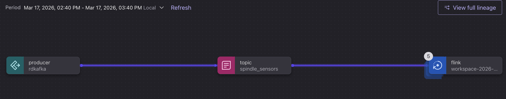
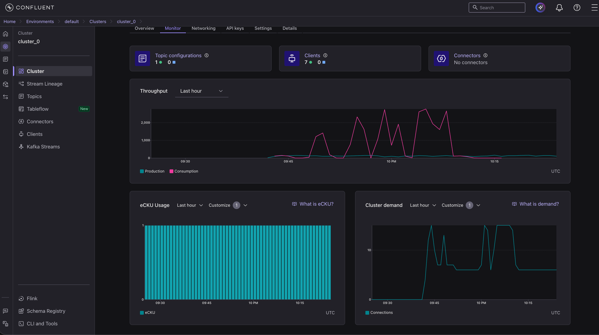

# Most-Flink-Driven
🧵 SpindleGuard: Real-Time IoT Thread Break Detection
Winner Category: Most Flink-Driven App

SpindleGuard is a real-time "nervous system" for textile factories. In traditional manufacturing, a thread break on a spinning spindle might go unnoticed for over an hour, leading to catastrophic material waste and machine downtime.

SpindleGuard reduces failure detection time from 60 minutes to less than 1 second.

🚀 The Architecture
The project demonstrates a complete end-to-end event-driven pipeline:

IoT Simulator (Python): Generates high-frequency sensor data (weight and status) and streams it via confluent-kafka.

Stream Backbone (Confluent Cloud): Ingests raw JSON events into a globally available Kafka topic.

Pattern Recognition (Apache Flink): Uses Complex Event Processing (CEP) to identify failure sequences in-flight.

Live Stream Lineage showing Python Producer $\rightarrow$ Kafka Topic $\rightarrow$ Flink SQL Statements."

🛠️ Tech Stack
Language: Python 3.x

Streaming Platform: Confluent Cloud (Kafka)

Processing Engine: Apache Flink SQL

Libraries: confluent-kafka, python-dotenv

🧠 The Flink Intelligence (CEP)
To win the prize for "Most Flink-Driven," we implemented advanced pattern matching using MATCH_RECOGNIZE. This allows the system to distinguish between normal machine vibration and a true thread break.

SQL
-- The logic that catches the "Normal -> Broken" transition
SELECT *
FROM spindle_sensors
MATCH_RECOGNIZE (
    PARTITION BY spindle_id
    ORDER BY ts
    MEASURES
        A.weight_grams AS weight_before,
        B.weight_grams AS weight_after,
        B.ts AS break_time
    ONE ROW PER MATCH
    PATTERN (A B)
    DEFINE
        A AS A.status = 'RUNNING',
        B AS B.status = 'BROKEN' AND B.weight_grams = 0
);
Visualizing the real-time data flow from IoT edge simulation to cloud-native stream processing.

💻 Getting Started
1. Prerequisites
A Confluent Cloud account with a Flink Compute Pool.

Python 3.10+ installed on your machine.

2. Installation
Bash
git clone https://github.com/YOUR_USERNAME/spindleguard
cd spindleguard
pip install -r requirements.txt
3. Configuration
Create a .env file based on the .env.example provided:

Plaintext
BOOTSTRAP_SERVER=pkc-xxxx.us-east1.gcp.confluent.cloud:9092
API_KEY=YOUR_KEY
API_SECRET=YOUR_SECRET
4. Run the Simulation
Bash
python3 script.py
📈 Impact
Zero-Downtime Monitoring: Instant notification of spindle failure.

Waste Reduction: Stops "blind spinning" immediately upon thread snap.

Scalability: Built on a decoupled architecture that can scale to 10,000+ sensors.

https://docs.google.com/presentation/d/1fZ2sR_7DlxL26mrq1EImiZwFbtRpbKy5Q7wYQVpnFPM/edit?usp=sharing